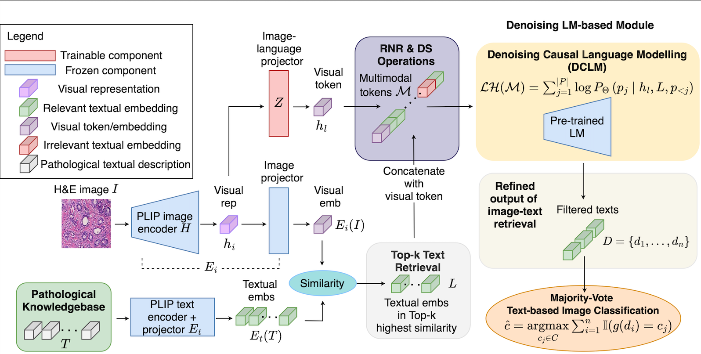

# Retrieval-based De-noising Causal Language Modelling for Zero-Shot Tumour Malignancy Recognition  *(ECAI 2025)*

🌐 **Project Page:** https://xw18958.github.io/RDCLM/

Xiao Wang · Usman Naseem · Jinman Kim*

---

## TL;DR
Vision–Language Foundation Models (VLFMs) are promising for zero-shot learning, but in histopathology they often suffer from **weak image–text alignment** due to coarse descriptions.  
**RDCLM** reduces retrieval noise by (1) building a pathology-specific description knowledge base, (2) retrieving top-k candidates with a pathology VLFM, and (3) **de-noising retrieved texts with a frozen language model** using multimodal token fusion.

---

## Method

  

**Key components**
- **Knowledge base**: fine-grained benign/malignant descriptions generated with an LLM
- **Retrieval**: query image → retrieve top-k candidate descriptions
- **De-noising (RDCLM)**: fuse visual features with retrieved texts → filter irrelevant content
- **Augmentations**: Retrieval Negatives Replacement (RNR) + Description-wise Shuffling (DS)

---

## Results (from the paper)
- Improves zero-shot **retrieval precision** by ~**10% on average** across datasets.
- Improves zero-shot **classification** by **+12.7% F1** and **+9.6% accuracy** over the second-best competitor (average).  
  *(See paper for per-dataset results.)*

---

## Repository structure
- `train.py` — main training/evaluation entry, includes the code of the proposed model and training process
- `knowledge_base.py` — knowledge-base with descritpions of benign and malignent tumours
- `util.py` — helpers (data processing / module functions)

---

## Quickstart
- run code `python train.py` 
